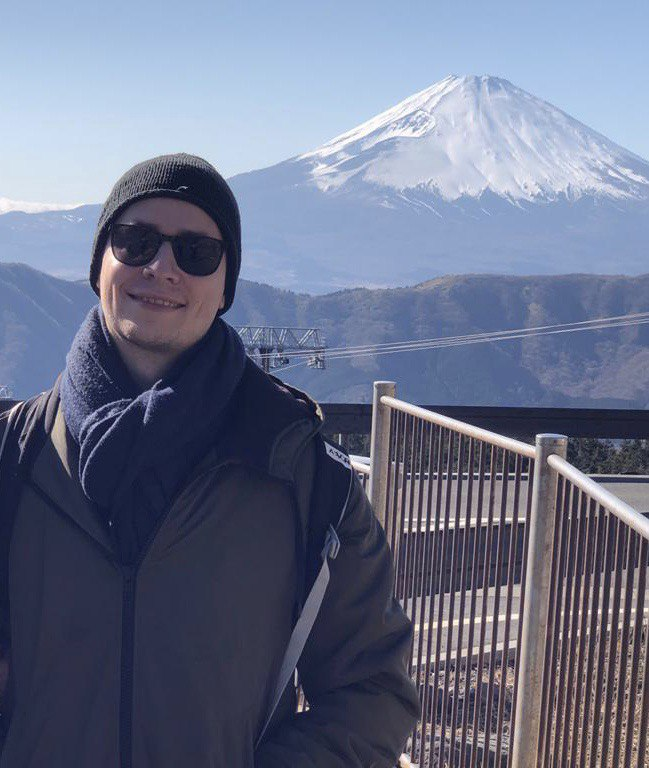

```{r setup, include=FALSE}
knitr::opts_chunk$set(echo = FALSE)

# Learn more about creating websites with Distill at:
# https://rstudio.github.io/distill/website.html

```



I am a PhD-Student at the department of Neurology at Carl von Ossietzky University Oldenburg. I investigate cognitive symptoms associated with Parkinson's disease (PD) with a focus on decision-making- and cognitive control abilities.  For my research I use a mix of  behavioral experiments, EEG recordings and a wide array of analysis methods, including Bayesian statistical modeling and Drift-Diffusion model analyses.
