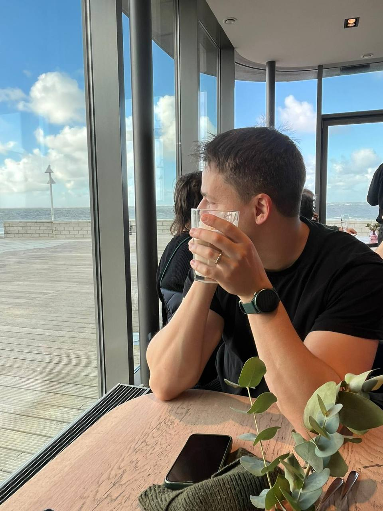

```{r setup, include=FALSE}
knitr::opts_chunk$set(echo = FALSE)

# Learn more about creating websites with Distill at:
# https://rstudio.github.io/distill/website.html

```



<div class="project-card">
I am a Data Analyst with CGM Mare and a former PhD student at the Department of Neurology at Carl von Ossietzky University Oldenburg. My doctoral research focuses on investigating cognitive symptoms associated with Parkinson's disease (PD), with a particular emphasis on decision-making and cognitive control abilities.

In my academic work, I employ a multifaceted approach combining behavioral experiments and EEG recordings. I utilize advanced analytical methods, including Bayesian statistical modeling and Drift-Diffusion model analyses.
</div>
